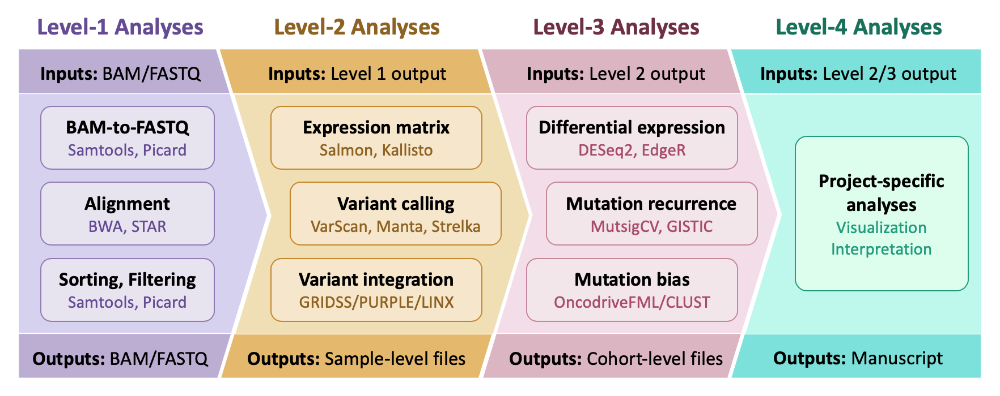

# lcr-modules: Standardizing genomic analyses

This project aims to become a collection of standard analytical modules for genomic and transcriptomic data. Too often do we copy-paste from each other’s pipelines, which has several pitfalls. Fortunately, all of these problems can be solved with standardized analytical modules, and the benefits are many. 

**Documentation:** https://lcr-modules.readthedocs.io/

**License:** [LICENSE](LICENSE)

## Installing oncopipe

```bash
pip install oncopipe
```

## Modules


