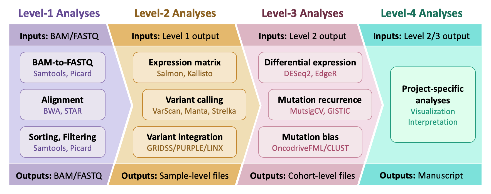
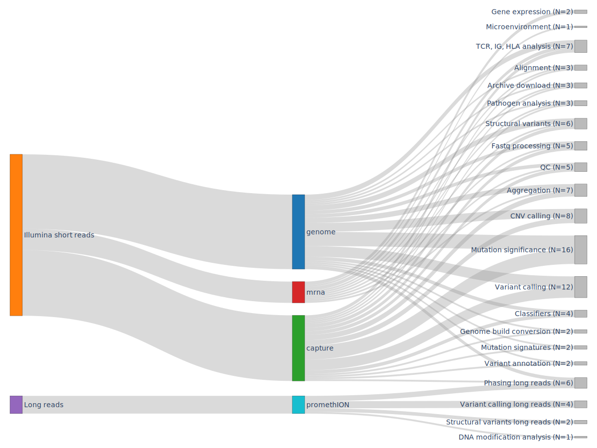

# lcr-modules: Standardizing genomic analyses

This project aims to become a collection of standard analytical modules for genomic and transcriptomic data. Too often do we copy-paste from each other’s pipelines, which has several pitfalls. Fortunately, all of these problems can be solved with standardized analytical modules, and the benefits are many. 

**Documentation:** [https://github.com/LCR-BCCRC/lcr-modules/wiki](https://github.com/LCR-BCCRC/lcr-modules/wiki)

**License:** [LICENSE](LICENSE)

## Installing compatible Snakemake

Run the following commands in your terminal to create the `opv12` environment with all necessary dependencies. 
```bash
conda deactivate
git clone https://github.com/LCR-BCCRC/lcr-modules.git
git clone https://github.com/LCR-BCCRC/lcr-scripts.git
cd lcr-modules/
conda env create -f demo/env.yaml
```

Always activate this environment before running any pipelines that use LCR-modules. 
```bash
conda activate opv12
```

You can check out demo project for the examples of how to use LCR-modules based on the data type, for example to analyze capture (`capture_Snakefile.smk`) or mrna (`mrna_Snakefile.smk`) data.
```bash
cd demo
./dry-run.sh capture_Snakefile.smk
./dry-run.sh mrna_Snakefile.smk
```

## Module levels overview

Level 1 modules perform low-level tasks such as adapter trimming, quality control, and alignment of sequencing files, and obtaining data from repositories such as the European Genome-phenome Archive (EGA). These modules also perform gene expression analyses, including alignment using STAR and calculating mRNA abundance using salmon. Level 2 modules perform routine tasks for cancer analysis, such as detecting and annotating simple somatic mutations, copy-number alterations, and structural variations.  Next, the level 3 modules perform analyses that rely on cohort-level aggregation. The cohorts and data sets can be flexibly defined based on different clinical characteristics through a set of configuration files. The modules at this level operate on the outputs of level 2 modules and perform tasks such as aggregation of individual files into cohort-level merges. Example workflows include analyses of mutation signatures, identification of significantly mutated genes, and sample classification into genetic subgroups.



## Currently available modules



The tables below list the purpose of each module and supported sequencing types. 

- [Aggregation](#aggregation)
- [Alignment](#alignment)
- [Archive download](#archive-download)
- [CNV calling](#cnv-calling)
- [Classifiers](#classifiers)
- [DNA modification analysis](#dna-modification-analysis)
- [Fastq processing](#fastq-processing)
- [Gene expression](#gene-expression)
- [Genome build conversion](#genome-build-conversion)
- [Microenvironment](#microenvironment)
- [Mutation signatures](#mutation-signatures)
- [Mutation significance](#mutation-significance)
- [Pathogen analysis](#pathogen-analysis)
- [Phasing long reads](#phasing-long-reads)
- [QC](#qc)
- [Structural variants](#structural-variants)
- [Structural variants long reads](#structural-variants-long-reads)
- [TCR, IG, HLA analysis](#tcr-ig-hla-analysis)
- [Variant annotation](#variant-annotation)
- [Variant calling](#variant-calling)
- [Variant calling long reads](#variant-calling-long-reads)

---

### Aggregation

| module | seq_type | output_type | data_type |
|---|---|---|---|
| [cnv_master](https://github.com/LCR-BCCRC/lcr-modules/tree/master/modules/cnv_master) | capture; genome | SEG | Illumina short reads |
| [starfish](https://github.com/LCR-BCCRC/lcr-modules/tree/master/modules/starfish) | capture; genome; mrna | VCF | Illumina short reads |
| [svar_master](https://github.com/LCR-BCCRC/lcr-modules/tree/master/modules/svar_master) | capture; genome | BEDPE | Illumina short reads |

### Alignment

| module | seq_type | output_type | data_type |
|---|---|---|---|
| [bwa_mem](https://github.com/LCR-BCCRC/lcr-modules/tree/master/modules/bwa_mem) | capture; genome | BAM/CRAM | Illumina short reads |
| [star](https://github.com/LCR-BCCRC/lcr-modules/tree/master/modules/star) | mrna | BAM | Illumina short reads |

### Archive download

| module | seq_type | output_type | data_type |
|---|---|---|---|
| [ega_download](https://github.com/LCR-BCCRC/lcr-modules/tree/master/modules/ega_download) | capture; genome; mrna | VARIOUS | Illumina short reads |

### CNV calling

| module | seq_type | output_type | data_type |
|---|---|---|---|
| [battenberg](https://github.com/LCR-BCCRC/lcr-modules/tree/master/modules/battenberg) | capture; genome | SEG | Illumina short reads |
| [cnvkit](https://github.com/LCR-BCCRC/lcr-modules/tree/master/modules/cnvkit) | capture; genome | SEG | Illumina short reads |
| [controlfreec](https://github.com/LCR-BCCRC/lcr-modules/tree/master/modules/controlfreec) | genome | SEG | Illumina short reads |
| [ichorcna](https://github.com/LCR-BCCRC/lcr-modules/tree/master/modules/ichorcna) | genome | SEG | Illumina short reads |
| [sequenza](https://github.com/LCR-BCCRC/lcr-modules/tree/master/modules/sequenza) | capture; genome | SEG | Illumina short reads |

### Classifiers

| module | seq_type | output_type | data_type |
|---|---|---|---|
| [dlbclass](https://github.com/LCR-BCCRC/lcr-modules/tree/master/modules/dlbclass) | capture; genome | TSV | Illumina short reads |
| [lymphgen](https://github.com/LCR-BCCRC/lcr-modules/tree/master/modules/lymphgen) | capture; genome | TSV | Illumina short reads |

### DNA modification analysis

| module | seq_type | output_type | data_type |
|---|---|---|---|
| [modkit](https://github.com/LCR-BCCRC/lcr-modules/tree/master/modules/modkit) | promethION | TSV | Long reads |

### Fastq processing

| module | seq_type | output_type | data_type |
|---|---|---|---|
| [bam2fastq](https://github.com/LCR-BCCRC/lcr-modules/tree/master/modules/bam2fastq) | capture; genome; mrna | FASTQ | Illumina short reads |
| [cutadapt](https://github.com/LCR-BCCRC/lcr-modules/tree/master/modules/cutadapt) | capture; genome | FASTQ | Illumina short reads |

### Gene expression

| module | seq_type | output_type | data_type |
|---|---|---|---|
| [salmon](https://github.com/LCR-BCCRC/lcr-modules/tree/master/modules/salmon) | mrna | TSV | Illumina short reads |
| [stringtie](https://github.com/LCR-BCCRC/lcr-modules/tree/master/modules/stringtie) | mrna | GTF | Illumina short reads |

### Genome build conversion

| module | seq_type | output_type | data_type |
|---|---|---|---|
| [liftover](https://github.com/LCR-BCCRC/lcr-modules/tree/master/modules/liftover) | capture; genome | VARIOUS | Illumina short reads |

### Microenvironment

| module | seq_type | output_type | data_type |
|---|---|---|---|
| [ecotyper](https://github.com/LCR-BCCRC/lcr-modules/tree/master/modules/ecotyper) | mrna | TSV | Illumina short reads |

### Mutation signatures

| module | seq_type | output_type | data_type |
|---|---|---|---|
| [sigprofiler](https://github.com/LCR-BCCRC/lcr-modules/tree/master/modules/sigprofiler) | capture; genome | TSV | Illumina short reads |

### Mutation significance

| module | seq_type | output_type | data_type |
|---|---|---|---|
| [dnds](https://github.com/LCR-BCCRC/lcr-modules/tree/master/modules/dnds) | capture; genome | TSV | Illumina short reads |
| [fishhook](https://github.com/LCR-BCCRC/lcr-modules/tree/master/modules/fishhook) | capture; genome | TSV | Illumina short reads |
| [gistic2](https://github.com/LCR-BCCRC/lcr-modules/tree/master/modules/gistic2) | capture; genome | TSV | Illumina short reads |
| [hotmaps](https://github.com/LCR-BCCRC/lcr-modules/tree/master/modules/hotmaps) | capture; genome | TSV | Illumina short reads |
| [mutsig](https://github.com/LCR-BCCRC/lcr-modules/tree/master/modules/mutsig) | capture; genome | TSV | Illumina short reads |
| [oncodriveclustl](https://github.com/LCR-BCCRC/lcr-modules/tree/master/modules/oncodriveclustl) | capture; genome | TSV | Illumina short reads |
| [oncodrivefml](https://github.com/LCR-BCCRC/lcr-modules/tree/master/modules/oncodrivefml) | capture; genome | TSV | Illumina short reads |
| [rainstorm](https://github.com/LCR-BCCRC/lcr-modules/tree/master/modules/rainstorm) | capture; genome | BED | Illumina short reads |

### Pathogen analysis

| module | seq_type | output_type | data_type |
|---|---|---|---|
| [pathseq](https://github.com/LCR-BCCRC/lcr-modules/tree/master/modules/pathseq) | capture; genome; mrna | TSV | Illumina short reads |

### Phasing long reads

| module | seq_type | output_type | data_type |
|---|---|---|---|
| [freebayes](https://github.com/LCR-BCCRC/lcr-modules/tree/master/modules/freebayes) | capture; genome | VCF | Illumina short reads |
| [nanomethphase](https://github.com/LCR-BCCRC/lcr-modules/tree/master/modules/nanomethphase) | promethION | TSV | Long reads |
| [phase_variants](https://github.com/LCR-BCCRC/lcr-modules/tree/master/modules/phase_variants) | promethION | VCF | Long reads |
| [whatshap](https://github.com/LCR-BCCRC/lcr-modules/tree/master/modules/whatshap) | genome; promethION | VCF | Illumina short reads |

### QC

| module | seq_type | output_type | data_type |
|---|---|---|---|
| [picard_qc](https://github.com/LCR-BCCRC/lcr-modules/tree/master/modules/picard_qc) | capture; genome; mrna | TSV | Illumina short reads |
| [qc](https://github.com/LCR-BCCRC/lcr-modules/tree/master/modules/qc) | capture; genome | TSV | Illumina short reads |

### Structural variants

| module | seq_type | output_type | data_type |
|---|---|---|---|
| [gridss](https://github.com/LCR-BCCRC/lcr-modules/tree/master/modules/gridss) | capture; genome | VCF | Illumina short reads |
| [hmftools](https://github.com/LCR-BCCRC/lcr-modules/tree/master/modules/hmftools) | genome | VCF | Illumina short reads |
| [manta](https://github.com/LCR-BCCRC/lcr-modules/tree/master/modules/manta) | capture; genome; mrna | VCF | Illumina short reads |

### Structural variants long reads

| module | seq_type | output_type | data_type |
|---|---|---|---|
| [cutesv](https://github.com/LCR-BCCRC/lcr-modules/tree/master/modules/cutesv) | promethION | VCF | Long reads |
| [sniffles](https://github.com/LCR-BCCRC/lcr-modules/tree/master/modules/sniffles) | promethION | VCF | Long reads |

### TCR, IG, HLA analysis

| module | seq_type | output_type | data_type |
|---|---|---|---|
| [igcaller](https://github.com/LCR-BCCRC/lcr-modules/tree/master/modules/igcaller) | capture; genome | TSV | Illumina short reads |
| [mixcr](https://github.com/LCR-BCCRC/lcr-modules/tree/master/modules/mixcr) | genome; mrna | TSV | Illumina short reads |
| [spechla](https://github.com/LCR-BCCRC/lcr-modules/tree/master/modules/spechla) | capture; genome; mrna | TSV | Illumina short reads |

### Variant annotation

| module | seq_type | output_type | data_type |
|---|---|---|---|
| [vcf2maf](https://github.com/LCR-BCCRC/lcr-modules/tree/master/modules/vcf2maf) | capture; genome | MAF | Illumina short reads |

### Variant calling

| module | seq_type | output_type | data_type |
|---|---|---|---|
| [lofreq](https://github.com/LCR-BCCRC/lcr-modules/tree/master/modules/lofreq) | capture; genome | VCF | Illumina short reads |
| [mutect2](https://github.com/LCR-BCCRC/lcr-modules/tree/master/modules/mutect2) | capture; genome | VCF | Illumina short reads |
| [sage](https://github.com/LCR-BCCRC/lcr-modules/tree/master/modules/sage) | capture; genome | VCF | Illumina short reads |
| [slms_3](https://github.com/LCR-BCCRC/lcr-modules/tree/master/modules/slms_3) | capture; genome | VCF | Illumina short reads |
| [strelka](https://github.com/LCR-BCCRC/lcr-modules/tree/master/modules/strelka) | capture; genome | VCF | Illumina short reads |
| [varscan](https://github.com/LCR-BCCRC/lcr-modules/tree/master/modules/varscan) | capture; genome | VCF | Illumina short reads |

### Variant calling long reads

| module | seq_type | output_type | data_type |
|---|---|---|---|
| [clair3](https://github.com/LCR-BCCRC/lcr-modules/tree/master/modules/clair3) | promethION | VCF | Long reads |
| [clairs](https://github.com/LCR-BCCRC/lcr-modules/tree/master/modules/clairs) | promethION | VCF | Long reads |
| [clairs_to](https://github.com/LCR-BCCRC/lcr-modules/tree/master/modules/clairs_to) | promethION | VCF | Long reads |
| [nanopolish](https://github.com/LCR-BCCRC/lcr-modules/tree/master/modules/nanopolish) | promethION | VCF | Long reads |
