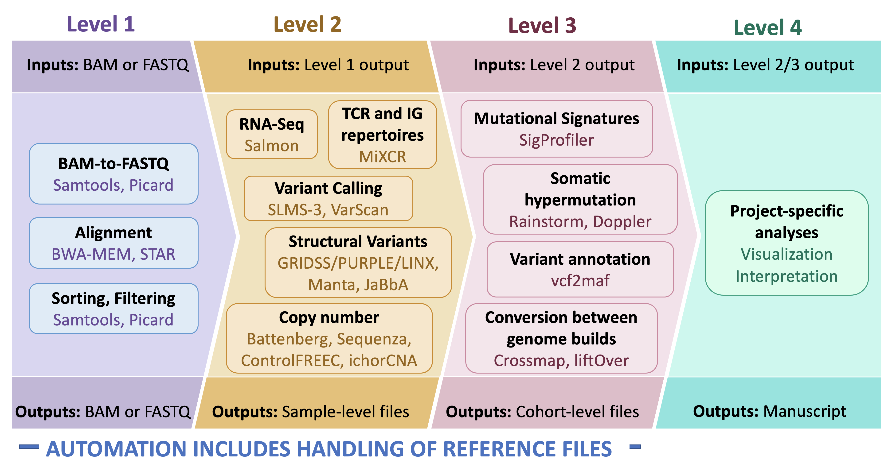

# lcr-modules: Standardizing genomic analyses

This project aims to become a collection of standard analytical modules for genomic and transcriptomic data. Too often do we copy-paste from each other’s pipelines, which has several pitfalls. Fortunately, all of these problems can be solved with standardized analytical modules, and the benefits are many. 

**Documentation:** https://lcr-modules.readthedocs.io/

**License:** [LICENSE](LICENSE)

## Installing modutils and cloning requires repositories

Clone modified ginkgo repository (originally by robertaboukhalil)
```bash
git clone --single-branch -b LCR-ginkgo https://github.com/LCR-BCCRC/ginkgo.git
```
Clone the ginkgo module from lcr-modules and install modutils
```bash
git clone --single-branch -b ginkgo_scWGS https://github.com/LCR-BCCRC/lcr-modules.git
pip install lcr-modules/modutils
```

## Modules



This branch consists of modules to run ginkgo, a single cell CNV caller.

Module inputs can be specified in the project-specific Snakefile using `md.set_input` or in the module's `default.yaml`. Values in the project snakefile will update the values set in `default.yaml`.

# ginkgo
Make sure that ginkgo inputs are accurate:
script = location of ginkgo.sh script, which is executed to run ginkgo
metrics = merged alignment summary metrics from picard_qc to filter out low count cells

see `modules/ginkgo/1.0/config/default.yaml` for more information


Example working directory containing `Snakefile`, `sample_libs.txt`, `datasheet.tsv`:
```
/projects/clc/clc_scratch/projects/hwinata/HL_scWGS/batch2/
```

sample results are stored in:
```
/projects/clc/clc_scratch/projects/hwinata/HL_scWGS/batch2/results_archived
```


